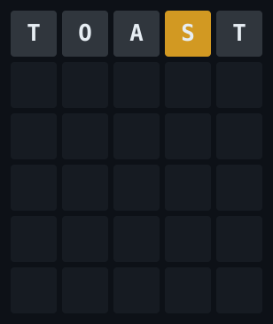
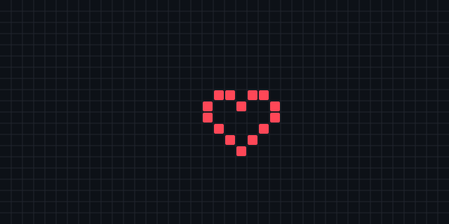

## Wordle

One shared puzzle a day — six guesses total for everyone combined, new word at 00:00 UTC.

**[Guess the word](https://github.com/Tsha0/Tsha0/issues/new?title=wordle%7Ccrane&body=Edit+the+title+to+%60wordle%7Cyourword%60+%28any+five-letter+word%29.+Submit+%E2%80%94+a+bot+scores+your+guess+and+closes+this+issue+within+a+minute.)** — edit the issue title to `wordle|yourword`, submit, and a bot scores it within a minute.

<!-- wordle-status -->
Today's puzzle: 2/6 guesses used — last guess by [@Tsha0](https://github.com/Tsha0).
<!-- /wordle-status -->

---

## Pixel canvas

A tiny r/place on my profile — anyone can paint, no account setup needed beyond GitHub itself.

**[Place a pixel](https://github.com/Tsha0/Tsha0/issues/new?title=place%7C12%7C5%7C%23ff4757&body=Edit+the+title+to+pick+your+pixel%3A+%60place%7Cx%7Cy%7C%23RRGGBB%60+%28x+0-39%2C+y+0-19%2C+top-left+is+0%2C0%29.+Then+submit+%E2%80%94+a+bot+paints+it+and+closes+this+issue+within+a+minute.)** — edit the issue title to `place|x|y|#RRGGBB`, submit, and a bot paints it within a minute.

<!-- canvas-latest -->
Latest pixel: (12, 5) painted #ff4757 by [@Tsha0](https://github.com/Tsha0)
<!-- /canvas-latest -->
